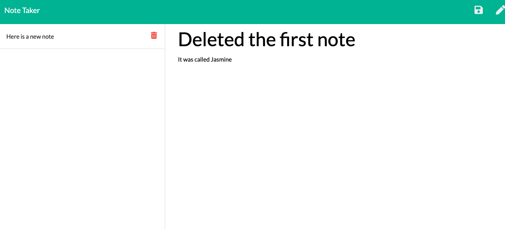
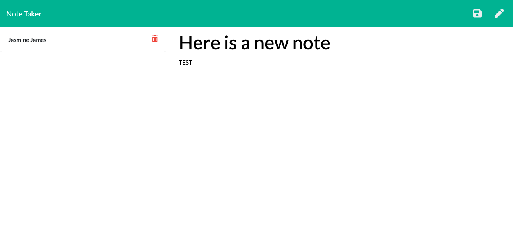

# note-taker-express

Note Taker

## Description 
This application allows the user to create a list of notes with a title and note body. They may also save and delete each note. 

## Table of Contents 

* [Installation](#installation)
* [Usage](#usage)
* [Contributing](#contributing)
* [Tests](#tests)
* [Questions](#questions)
* [License](#license)

## Installation
The application will run from the heroku deployment 
[GitHubRepo] (https://github.com/jasdjames/note-taker-express)
[Heroku] (https://pure-peak-57226.herokuapp.com/)

## Usage 
This application will allow the user to type the notes in a text box with a title. Upon saving the note it will populate in a column on the left. The note can then be deleted by pushing the trash can icon. 

I have included photos below:

## Contributing
Please contact me by email or github for contribution

## Tests
No test were completed for the completion of this project

## Questions
Please contact me via email for more information on this application. 
[JasDJames]
(https://github.com/JasDJames)
jasdjames@gmail.com

## License
MIT
MIT License

    Copyright (c) [year] [JasDJames]
    
    Permission is hereby granted, free of charge, to any person obtaining a copy
    of this software and associated documentation files (the "Software"), to deal
    in the Software without restriction, including without limitation the rights
    to use, copy, modify, merge, publish, distribute, sublicense, and/or sell
    copies of the Software, and to permit persons to whom the Software is
    furnished to do so, subject to the following conditions:
    
    The above copyright notice and this permission notice shall be included in all
    copies or substantial portions of the Software.
    
    THE SOFTWARE IS PROVIDED "AS IS", WITHOUT WARRANTY OF ANY KIND, EXPRESS OR
    IMPLIED, INCLUDING BUT NOT LIMITED TO THE WARRANTIES OF MERCHANTABILITY,
    FITNESS FOR A PARTICULAR PURPOSE AND NONINFRINGEMENT. IN NO EVENT SHALL THE
    AUTHORS OR COPYRIGHT HOLDERS BE LIABLE FOR ANY CLAIM, DAMAGES OR OTHER
    LIABILITY, WHETHER IN AN ACTION OF CONTRACT, TORT OR OTHERWISE, ARISING FROM,
    OUT OF OR IN CONNECTION WITH THE SOFTWARE OR THE USE OR OTHER DEALINGS IN THE
    SOFTWARE.